# Alistice
Alistice is a web application which enables us to manage our bookmarks on the cloud. 

It was intended to help a person who stacks a lot of old and messy resources in web browsers.

The core directories are as follows:
- frontend: JavaScript codes on Vue.js
- backend: Python 3 codes on Flask
- tool: an automatic bookmarks importation tool from browsers by Python


## How to Use
First of all, set
- MAIL_USERNAME and MAIL_PASSWORD in .env and .dev.env file based on your Gmail address
- and its [App Passwords](https://support.google.com/accounts/answer/185833?hl=en)

at least.

Then, start Docker daemon and innovate
```
make sta
```
in the project root.

Now you can see the app from the preview of Kinematic!

If you want to quit it, use `docker-compose stop`.


Furthermore, the frontend alone would be runnable by `cd frontend && yarn install && yarn nbp && yarn serve`.

## Historical Images
I had worked on this project for about 2 years since I was very beginner of programming (mainly August 2018 - March 2020).
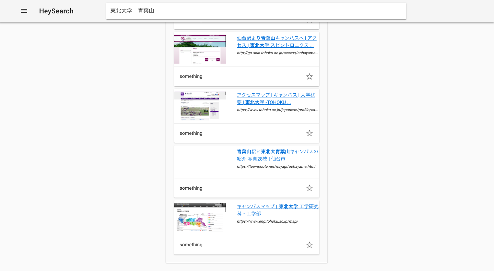
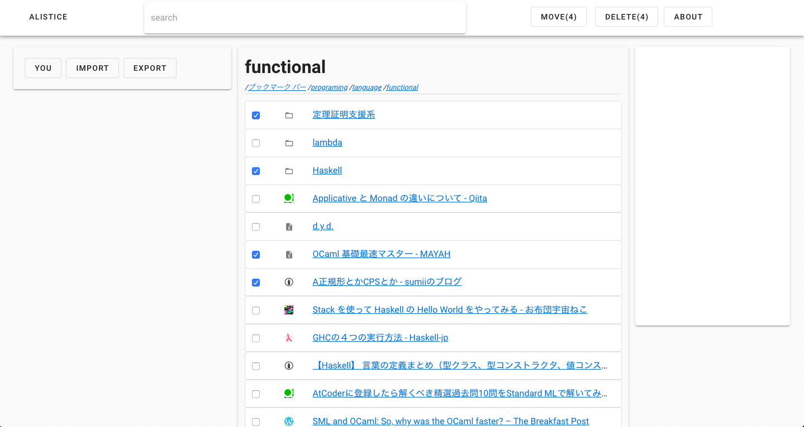
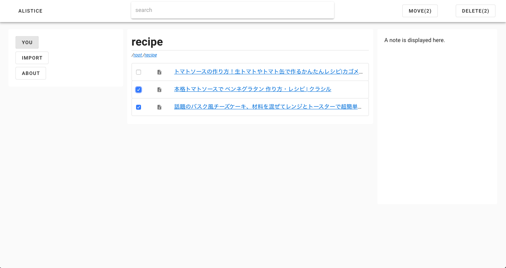
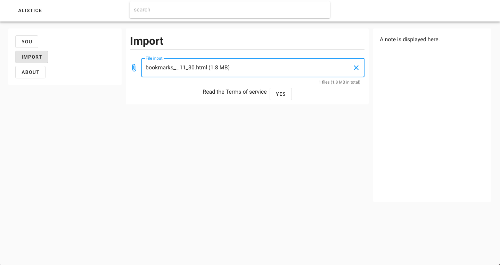
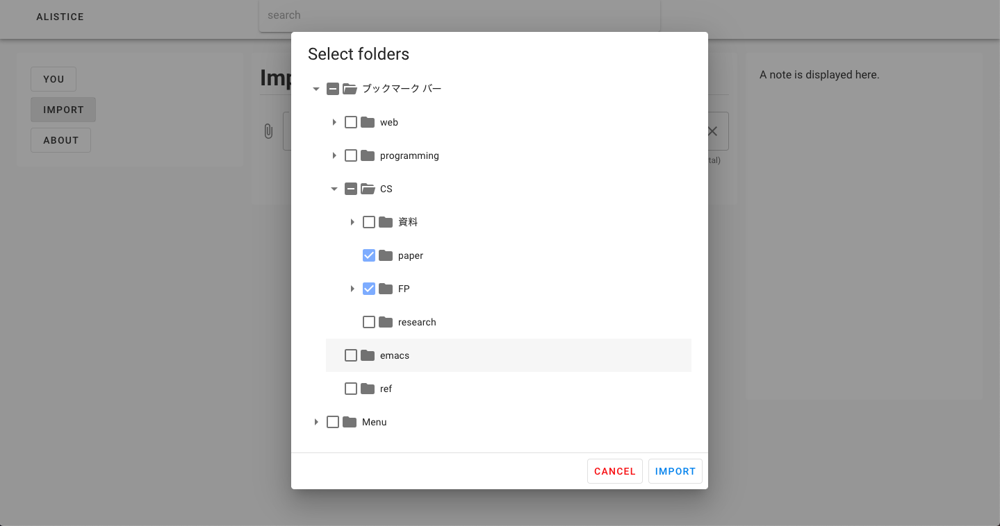
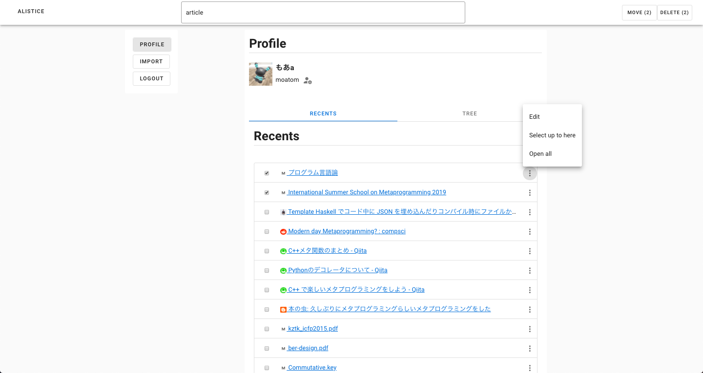
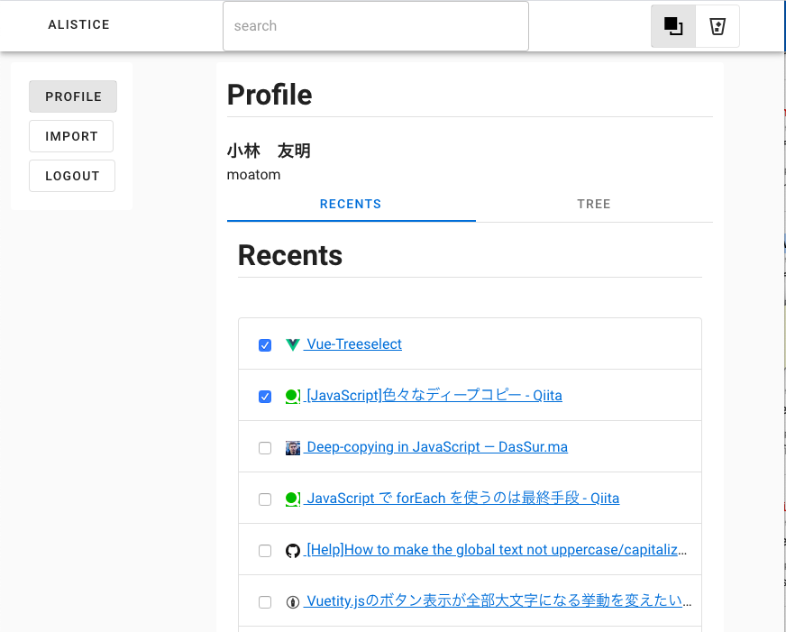
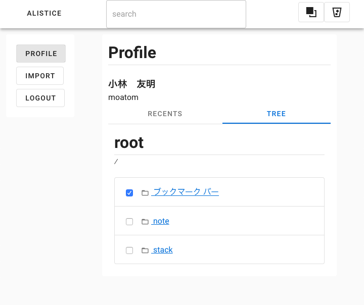
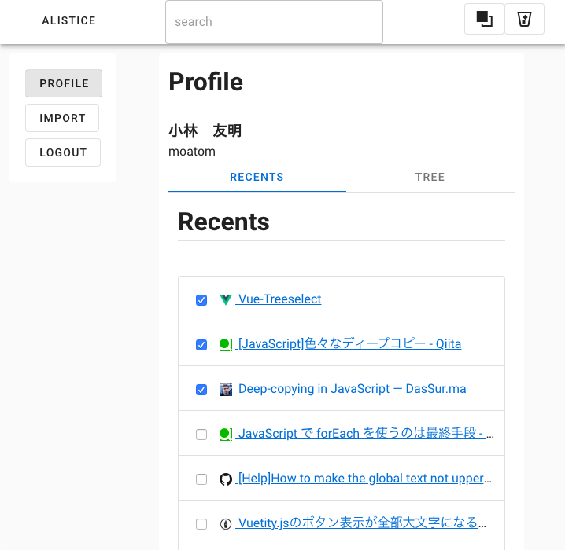
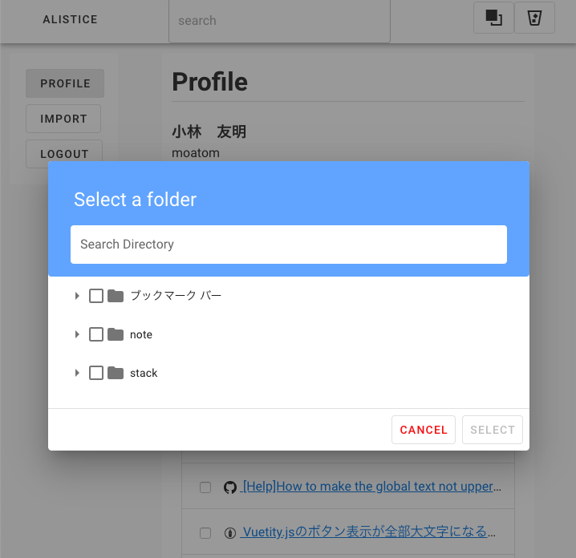
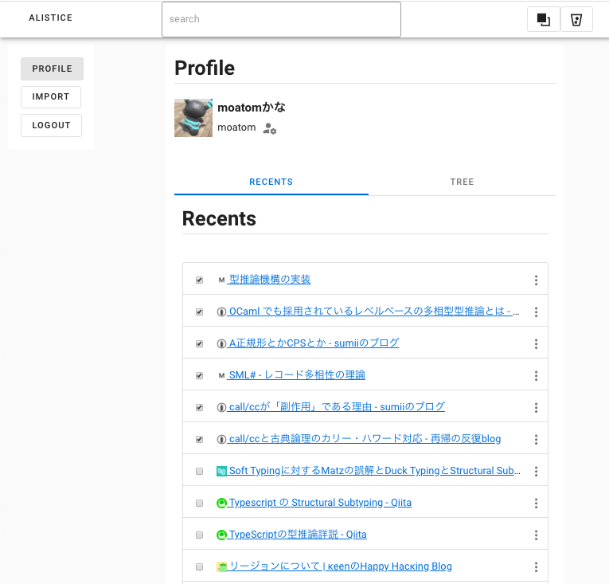

## Development
- for the frontend
```
yarn serve
```
- for the backend (depending on mongodb, sqlite, and redis)
```
source .dev.env 
redis-server &
celery -A src.extentions.celery worker --loglevel=info &
python3 run.py
```

## Delete Caches
- docker:
  https://qiita.com/tifa2chan/items/e9aa408244687a63a0ae, https://qiita.com/shinespark/items/526b70b5f0b1ac643ba0
- hard-source: `rm -rf node_modules/.cache/hard-source/`
  https://sunday-morning.app/posts/2019-07-09-hard-source-webpack-plugin/
- nginx: `rm -rf /var/cache/nginx/`
